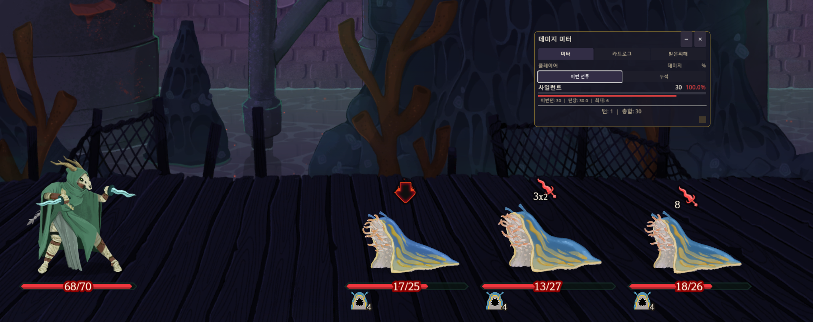
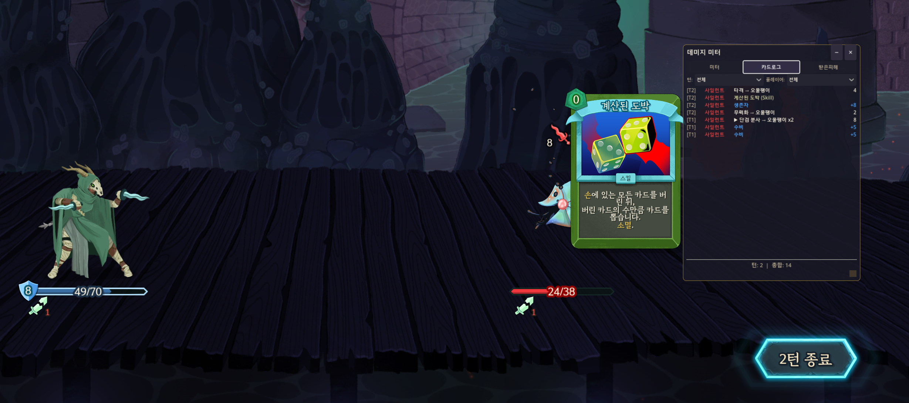
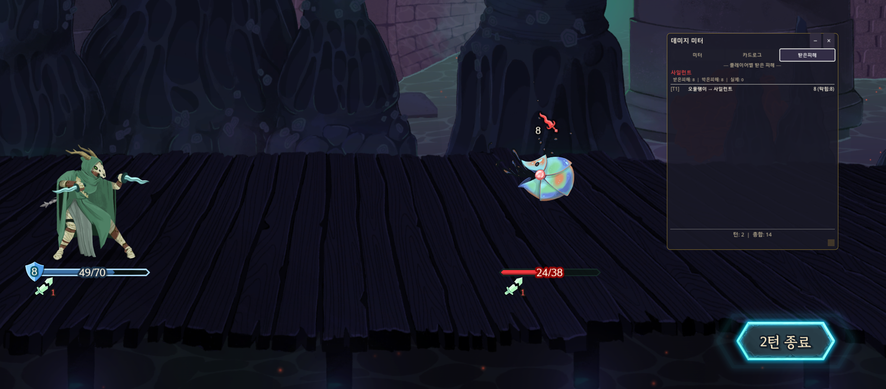
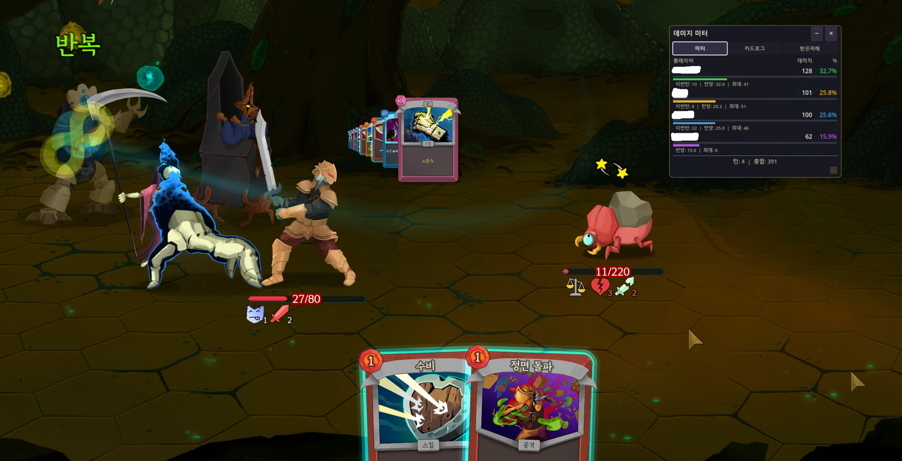

# Damage Meter Mod for Slay the Spire 2

## 한국어

Slay the Spire 2 실시간 데미지 미터 모드. 솔로 및 코옵(멀티플레이) 모두 지원합니다.

### 기능

#### 미터 탭

플레이어별 총 데미지와 비율을 실시간으로 표시합니다. **이번 전투 / 누적** 모드를 전환할 수 있습니다.

| 이번 전투 | 누적 |
|:-:|:-:|
|  |  |

- 플레이어별 데미지 합산 및 비율 바
- 이번턴 / 턴당 평균 / 최대 데미지 통계
- 독 데미지 비례 귀속 추적
- **누적 모드**: 런 전체 데미지를 추적하며, 전투당 평균 데미지를 표시. 새 런 시작 시 자동 초기화

#### 카드로그 탭

카드별 상세 데미지 내역을 기록하며, 카드 이름에 마우스를 올리면 게임 내 툴팁을 확인할 수 있습니다.



- 사용한 카드와 데미지 기록
- 대상 이름, 막은 데미지, 처치 여부 표시
- 카드 이름 호버 시 게임 내 카드 툴팁 표시

#### 받은피해 탭

플레이어별 받은 피해, 막은 피해, 실제 피해를 추적합니다.



- 플레이어별 받은피해 / 막은피해 / 실제피해
- 턴별 피해 추적

#### 코옵 지원

멀티플레이에서 각 플레이어의 데미지를 개별 추적합니다.



- 모든 플레이어의 데미지를 동시에 표시
- 소환수/펫 데미지는 소유자에게 귀속 (예: 네크로 소환수)

### 설치 방법

1. [Releases](https://github.com/Heinul/sts2_meter/releases)에서 최신 `DamageMeterMod.dll`과 `DamageMeterMod.pck`를 다운로드합니다.
2. 두 파일을 Slay the Spire 2 mods 폴더에 넣습니다:
   ```
   C:\Program Files (x86)\Steam\steamapps\common\Slay the Spire 2\mods\
   ```
3. 게임을 실행합니다.

### 세이브 프로필 구조

모드를 사용하면 게임이 자동으로 `modded/` 폴더에 별도 세이브를 생성합니다. 바닐라 세이브와 완전히 분리되어 있어 모드를 켜고 꺼도 세이브가 섞이지 않습니다.

```
SlayTheSpire2/steam/{SteamID}/
├── profile1/          ← 바닐라 프로필 1
├── profile2/          ← 바닐라 프로필 2
├── profile3/          ← 바닐라 프로필 3
├── settings.save
└── modded/
    ├── profile1/      ← 모드 프로필 1
    ├── profile2/      ← 모드 프로필 2
    └── profile3/      ← 모드 프로필 3
```

> 세이브 경로: `%APPDATA%\SlayTheSpire2\steam\{SteamID}\`

바닐라 진행 상황을 모드 쪽으로 가져오고 싶다면, 해당 프로필 폴더를 `modded/` 안에 복사하면 됩니다:

```
profile1/ → modded/profile1/
```

### 사용법

| 키 | 기능 |
|----|------|
| **F7** | 데미지 미터 표시/숨기기 |

- 전투 시작 시 자동 초기화됩니다
- 우측 하단 모서리를 드래그하여 크기 조절
- **미터**, **카드로그**, **받은피해** 탭 전환 가능
- 드롭다운 메뉴로 턴/플레이어 필터링

### 언어 지원

게임 언어 설정을 자동으로 감지합니다.

- **한국어**
- **English** (기본값)

지원하지 않는 언어는 영어로 표시됩니다.

---

## English

Real-time damage tracking overlay for Slay the Spire 2. Supports both solo and co-op play.

### Features

#### Meter Tab

Track total damage dealt by each player with percentage bars. Toggle between **This Combat / Cumulative** modes.

| This Combat | Cumulative |
|:-:|:-:|
|  |  |

- Per-player damage totals and percentage
- Current turn / per-turn / max damage stats
- Poison damage tracking with proportional attribution
- **Cumulative mode**: Tracks damage across the entire run with per-combat averages. Auto-resets on new run

#### Card Log Tab

Detailed per-card damage breakdown with hover tooltips showing card info.


- Every card played and its damage recorded
- Target name, blocked damage, and kill tracking
- Hover over a card name to see its in-game tooltip

#### Received Damage Tab

Damage taken by each player, including blocked amounts.


- Total received / blocked / actual damage per player
- Turn-by-turn damage tracking

#### Co-op Support

Full multiplayer support — each player's damage is tracked individually.


- All players displayed in the meter simultaneously
- Pet/summon damage attributed to their owner (e.g., Necromancer summons)

### Installation

1. Download the latest `DamageMeterMod.dll` and `DamageMeterMod.pck` from [Releases](https://github.com/Heinul/sts2_meter/releases)
2. Place both files in your Slay the Spire 2 mods folder:
   ```
   C:\Program Files (x86)\Steam\steamapps\common\Slay the Spire 2\mods\
   ```
3. Launch the game

### Save Profile Structure

When mods are active, the game automatically creates separate saves under the `modded/` folder. Vanilla and modded saves are fully isolated.

```
SlayTheSpire2/steam/{SteamID}/
├── profile1/          ← Vanilla profile 1
├── profile2/          ← Vanilla profile 2
├── profile3/          ← Vanilla profile 3
├── settings.save
└── modded/
    ├── profile1/      ← Modded profile 1
    ├── profile2/      ← Modded profile 2
    └── profile3/      ← Modded profile 3
```

> Save path: `%APPDATA%\SlayTheSpire2\steam\{SteamID}\`

To carry over your vanilla progress to modded, copy the profile folder into `modded/`:

```
profile1/ → modded/profile1/
```

### Usage

| Key | Action |
|-----|--------|
| **F7** | Toggle damage meter on/off |

- The meter automatically resets at the start of each combat
- Drag the bottom-right corner to resize the window
- Switch between tabs: **Meter**, **Card Log**, **Received**
- Filter by turn or player using the dropdown menus

### Language Support

The mod automatically detects your game language setting.

- **Korean** (한국어)
- **English** (default)

Other languages fall back to English.

---

## Build from Source

.NET 9.0 SDK and Slay the Spire 2 required.

```bash
dotnet build -c Release
```

Release build automatically copies the DLL to the game's `mods/` folder.

## License

MIT

## Author

**HeiNul** — [GitHub](https://github.com/Heinul)
